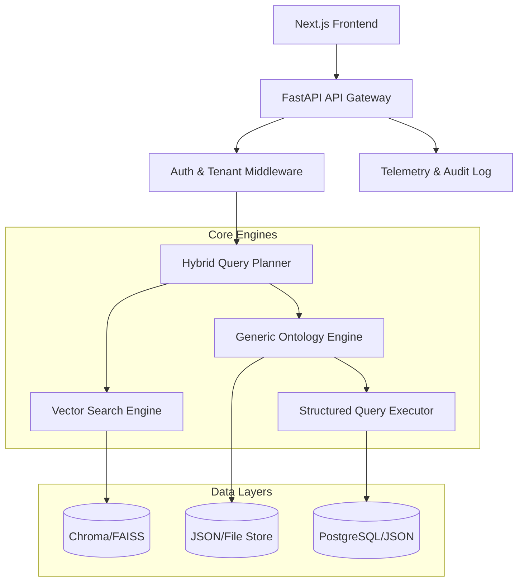

# 02. 아키텍처 및 시스템 설계서 (Architecture & Design)

## 1. 시스템 아키텍처 (High-Level)

시스템은 **Layered Architecture**를 기반으로 하며, 도메인 중립적인 **Generic Service** 구조를 지향합니다.



---

## 2. 상세 설계 (Detailed Design)

### 2.1 Query Planner 기반 하이브리드 질의
질문이 들어오면 LLM은 바로 답변을 생성하지 않고 **실행 계획(Plan)**을 JSON 형태로 생성합니다.

- **Plan 구조 (Example)**:
  ```json
  {
    "strategy": "hybrid",
    "tasks": [
      {
        "type": "ontology_filter",
        "params": { "type": "ORDER", "status": "PENDING", "min_amount": 1000000 }
      },
      {
        "type": "vector_search",
        "params": { "query": "환불 규정 및 지연 배상 정책", "top_k": 3 }
      }
    ],
    "merger": "contextual_synthesis"
  }
  ```
- **Executor**: Python 코드가 위 JSON을 파싱하여 실제 DB 및 벡터 검색을 수행합니다. LLM은 최종적으로 추출된 **'팩트'**들만 조합하여 자연어로 응답합니다.

### 2.2 범용 온톨로지 엔진 (Generic Ontology Engine)
특정 도메인에 종속되지 않은 추상화된 데이터 모델을 사용합니다.

- **Entity Model**: `(id, type_name, properties_json, company_id, project_id)`
- **Relation Model**: `(source_id, target_id, relation_type_name, properties_json)`
- **Schema Engine**: `ontology.config.json` 파일을 읽어 `type_name`과 `property`의 유효성을 런타임에 검증합니다.

### 2.3 테넌트 기반 보안 미들웨어
모든 요청은 다음과 같은 흐름으로 보안 검증을 거칩니다.

1. **JWT Extract**: 헤더에서 `company_id`, `user_id`, `role` 추출.
2. **Context Injection**: 요청 컨텍스트(`request.state.tenant`)에 테넌트 정보 주입.
3. **Repository Filter**: 모든 DB 쿼리(Vector, Graph)에 `WHERE company_id = current_tenant_id` 조건을 자동 강제.

---

## 3. 데이터 흐름 (Data Flow: Document Ingestion)

1. **Upload**: 사용자가 PDF 업로드.
2. **Parsing**: 텍스트 및 레이아웃 추출.
3. **Vectorizing**: 문장 단위 임베딩 및 Vector DB 저장.
4. **Knowledge Extraction**: 
    - LLM이 문서에서 온톨로지 스키마에 정의된 엔티티와 관계를 추출.
    - 추출된 데이터는 **보정 대기(Pending)** 상태로 저장.
5. **Human Correction**: 사용자가 UI에서 추출 결과를 확인/수정 후 **확정(Confirmed)**.

---

## 4. 모니터링 및 운영 (Observability)

- **Audit Logging**: `[Timestamp][User][Action][Resource][Result]` 형식의 모든 행위 기록.
- **Quality Metrics**: 
    - **Hit Rate**: 벡터 검색의 정확도.
    - **Plan Success Rate**: 질의 플래너가 유효한 실행 계획을 세운 비율.
    - **Token Usage**: 요청당 소요 비용 추적.
