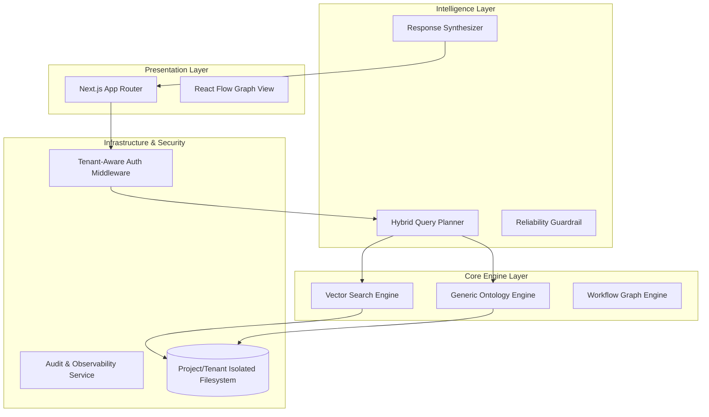

# 02. 엔터프라이즈 아키텍처 및 상세 설계서 (Architecture & Design)

## 1. 아키텍처 개요 (Layered Platform Architecture)

본 시스템은 **"데이터 격리 - 범용 엔진 - 지능형 질의"**로 이어지는 3단계 레이어 구조를 가집니다.

---

## 2. 레이어별 상세 설계

### 2.1 보안 및 격리 레이어 (Tenant-Aware Middleware)
- **Context Management**: FastAPI의 `Dependency Injection`과 `request.state`를 활용하여 요청의 시작부터 끝까지 `tenant_id`를 추적.
- **Repository Pattern**: 모든 데이터 접근 객체(DAO)는 인스턴스화 시 강제로 테넌트 필터를 주입받아, 실수에 의한 데이터 노출 차단.

### 2.2 지능형 질의 레이어 (Query Planner & Executor)
단순한 텍스트 답변 생성을 넘어, 정교한 **실행 계획** 기반 시스템을 구축합니다.
- **Planner (LLM)**: 자연어 질문을 해석하여 `Strategy` 결정 (Vector Only / Ontology Only / Hybrid).
- **Executor (Code)**: 
    - 온톨로지: `filter`, `compare`, `calculate`, `hop` 연산 수행.
    - 벡터: 시맨틱 검색 후 최상위 컨텍스트 추출.
- **Synthesizer (LLM)**: 실행 결과(팩트 데이터)를 바탕으로 최종 답변 생성.

### 2.3 데이터 레이어 (Generic Schema Engine)
- **JSON Driven UI**: 백엔드 스키마 정의(`ontology.schema.json`)가 프론트엔드의 폼(Form), 테이블, 그래프 레이아웃을 결정하는 **Server-Driven UI** 방식 지향.
- **Persistence**: 파일 기반 저장소(JSON)를 사용하되, 테넌트별 하위 디렉토리로 물리적 분리.

---

## 3. 핵심 모듈 상세 설계

### 3.1 GenericOntologyService
- `register_type()`: 신규 타입 및 속성 유효성 정의.
- `ask_structured()`: 구조형 질의(DSL)를 파싱하여 결과 반환.
- `link_entities()`: 엔티티 간 관계 생성 및 무결성 체크 (Source/Target 타입 검증).

### 3.2 HybridQueryEngine
- **RAG Integration**: BM25와 벡터 검색의 하이브리드 점수 산출(RRF 등).
- **Context Augmentation**: 벡터 검색 결과에 온톨로지의 연관 지식(1-hop 관계)을 자동으로 추가하여 컨텍스트 풍부화.

---

## 4. 데이터 보안 및 신뢰성 설계

- **Encryption at Rest**: 민감 정보 속성(Sensitive Property)은 저장 시 자동 암호화 처리.
- **Audit Trail**: 모든 '쓰기' 행위에 대해 `who, when, what, before, after`를 기록하는 감사 로그 모듈 구축.
- **Auto-Evaluation**: 질의 발생 시마다 자동으로 답변의 근거 포함 여부를 체크하여 품질 지표(Quality Metric) 산출.
