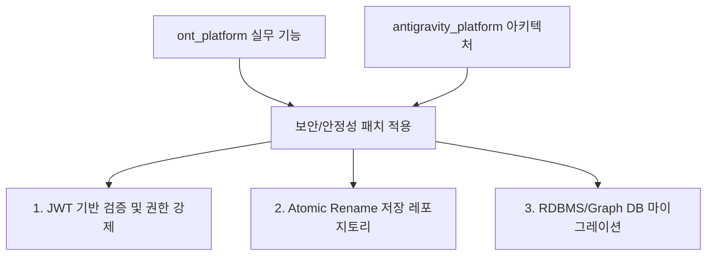

# ont_platform (v3) 기술 분석 및 한계점 보고서

> **작성자**: Antigravity  
> **작성일**: 2026-05-24  
> **대상**: `E:\ontology_edu\X_ont_std\ont_platform\v3` 백엔드  
> **목적**: 핵심 워크플로우 및 온톨로지 관리 로직의 성능, 동시성, 보안 관점 취약점 분석 및 개선 방안 제시  

---

## 📊 종합 평가 요약

`ont_platform (v3)`은 다양한 온톨로지 스타일(RDF, SPARQL, Lineage) 및 워크플로우 기능 시나리오를 충실히 구현하여 단위 테스트 통과율(98.5%)이 매우 높지만, **엔터프라이즈 환경에서의 대량 데이터 처리, 다중 사용자 동시 접속, 그리고 보안 신뢰성 관점**에서는 아래와 같은 치명적인 설계적 한계를 가지고 있습니다.

---

## 1. 온톨로지 구성 및 질의 로직 한계 (Simulation & Naive Logic)

> [!WARNING]
> 현재 구현된 온톨로지 표준 기술(SPARQL, RDF)은 실제 규격을 만족하지 않는 **시뮬레이션(Mock) 수준**에 머물러 있습니다.

### ① 규격 미달의 가짜 SPARQL 엔진
*   **파일 위치**: [`sparql_engine.py`](file:///E:/ontology_edu/X_ont_std/ont_platform/v3/src/backend/app/services/sparql_engine.py)
*   **분석**: 표준 AST(Abstract Syntax Tree) 파서를 사용하는 대신 정규 표현식(`re.findall`)과 공백 기반 스플릿(`parts = pattern.split()`)을 사용해 트리플을 검색합니다.
*   **영향**: 복잡한 다중 조인(Join), `UNION`, `PREFIX` 처리, 서브쿼리, 필터 조건 등이 포함된 실무 SPARQL 쿼리를 날릴 경우 분석 실패 혹은 오동작을 일으킵니다.

### ② 외부 임포터의 시뮬레이션(Mocking) 처리
*   **파일 위치**: [`ontology_importer.py`](file:///E:/ontology_edu/X_ont_std/ont_platform/v3/src/backend/app/services/ontology_importer.py)
*   **분석**: DBpedia, Wikidata, schema.org 등에서 데이터를 가져오는 함수들이 실제 외부 네트워크 API를 호출하지 않고 하드코딩된 **임시 더미 데이터를 리턴**합니다.
*   **영향**: 실제 엔터프라이즈 표준 온톨로지 데이터를 외부망에서 실시간으로 융합하는 것이 불가능합니다.
*   **RDF 파일 파싱 미흡**: `import_rdf_file` 또한 표준 RDF 라이브러리(`rdflib` 등)를 쓰지 않고 Turtle 파일 텍스트를 공백으로 대충 쪼개어 파싱하므로, 주석/멀티라인 리터럴/Blank Node 등이 포함된 실제 Turtle 파일을 임포트하면 즉시 파싱 에러가 발생합니다.

---

## 2. 성능 및 대량 데이터 처리 한계 (Performance & Scalability)

> [!CAUTION]
> 데이터 규모가 커질수록 기하급수적으로 응답 속도가 느려지고 파일 I/O 대기(Blocking)가 늘어나는 $O(N)$ 풀 스캔 구조를 가지고 있습니다.

### ① 디렉토리 전체 파일 풀 스캔 병목
*   **파일 위치**: [`ontology.py`의 list_all_entities](file:///E:/ontology_edu/X_ont_std/ont_platform/v3/src/backend/app/repositories/ontology.py#L27)
*   **분석**: 데이터베이스 인덱스 없이 로컬 저장소 내부의 모든 JSON 파일 리스트를 `glob`으로 긁어모아 `json.loads`로 메모리에 올리는 파일 기반 방식을 사용합니다.
*   **영향**: 엔터프라이즈 환경에서 데이터가 누적되어 온톨로지 파일 수가 수만 개가 되면 단 한 번의 조회를 위해서 모든 파일을 동기적으로 읽고 파싱해야 하므로 디스크 I/O가 폭증하고 CPU 과부하가 발생합니다.

### ② 트리플(Triple) 데이터의 인메모리 관리
*   **분석**: 외부에서 임포트한 RDF 트리플 데이터가 물리적 DB에 영속화되지 않고 파이썬 프로세스 내의 리스트(`self.triples`)로만 관리됩니다.
*   **영향**: 
    1. FastAPI 서버가 재시작되면 기껏 로드해 둔 온톨로지 트리플 데이터가 전부 소실됩니다.
    2. 데이터가 누적될수록 서버 메모리(RAM) 사용량이 제한 없이 늘어나 대량 트래픽 상황에서 OOM(Out of Memory)으로 서버가 다운될 위험이 있습니다.

---

## 3. 동시 처리 및 데이터 정합성 이슈 (Concurrency & Race Condition)

### ① 원자적 쓰기(Atomic Write) 누락으로 인한 파일 훼손 위험
*   **파일 위치**: [`base.py`의 _save_json](file:///E:/ontology_edu/X_ont_std/ont_platform/v3/src/backend/app/repositories/base.py#L37)
*   **분석**: 파일에 데이터를 쓸 때 표준 `path.write_text()`로 직접 파일에 덮어씁니다.
*   **영향**: 다수의 온톨로지 관리자가 동시에 엔티티나 관계를 추가/수정하는 API 요청을 보내면, 파일 쓰기 충돌로 인해 데이터가 중간에 잘리거나 깨지는 **파일 손상(File Corruption)** 및 나중 쓰기가 이전 데이터를 덮어써서 유실되는 레이스 컨디션(Race Condition)이 발생합니다.

### ② 트랜잭션 및 파일 잠금(File Locking) 부재
*   **분석**: 여러 uvicorn 워커 프로세스 간에 자원을 보호하기 위한 잠금 메커니즘이 전혀 없습니다.
*   **영향**: 한 사용자가 관계(Relationship)를 삭제하는 동시에 다른 사용자가 대상 엔티티(Entity)를 수정하면 데이터 무결성이 파괴되고 존재하지 않는 엔티티를 가리키는 고아 관계 데이터가 양산됩니다.

---

## 4. 보안 및 권한 제어 취약점 (Security & Governance)

> [!IMPORTANT]
> 테넌트 분리가 API 호출 수준에서 쉽게 위조될 수 있는 보안 취약점이 있습니다.

```
[ 위조 시나리오 ]
공격자 (회사 B / 일반 User) ── HTTP Header 조작 (X-Company-Id: A, X-Role: Admin) ──> ont_platform API ──> 회사 A의 어드민 권한 및 데이터에 탈취/삭제 접근 성공 ⚠️
```

### ① 위조 가능한 TenantContext 주입 구조
*   **파일 위치**: [`workflow.py`의 _ctx](file:///E:/ontology_edu/X_ont_std/ont_platform/v3/src/backend/app/api/workflow.py#L35)
*   **분석**: 테넌트 정보(`TenantContext`)를 암호화된 JWT 토큰 검증 단계 없이, 단순히 사용자가 보낸 HTTP Request Header (`X-Company-Id`, `X-Project-Id`, `X-Role`) 값을 그대로 수집하여 권한을 판정합니다.
*   **영향**: 외부에서 Postman이나 curl 등으로 HTTP 헤더만 조작하면 다른 회사/다른 프로젝트 데이터를 마음대로 읽고 쓸 수 있어 테넌트 격리가 무력화되고 권한 상승(Privilege Escalation) 공격이 가능합니다.

---

## 5. `antigravity_platform`을 통한 개선 및 연계 방안

`antigravity_platform`에서 검증된 핵심 격리 및 안정성 아키텍처를 `ont_platform`에 적용함으로써 위에서 언급한 병목 및 취약점을 대부분 해결할 수 있습니다.



### ① JWT 기반 테넌트 보안 포팅
*   **이식 대상**: `antigravity_platform`의 [IdentityMiddleware](file:///E:/ontology_edu/X_ont_std/antigravity_platform/project/src/backend/app/api/middleware.py#L7)
*   **방법**: 단순 HTTP 헤더 수집 방식을 폐기하고 JWT 토큰의 서명을 서브 네트워크 단에서 검증하여 `request.state.identity`를 채우는 구조로 변경. 헤더 조작을 통한 권한 상승 및 타 테넌트 침범 원천 차단.

### ② 원자적 파일 쓰기 레포지토리 패턴 도입
*   **이식 대상**: `antigravity_platform`의 [BaseRepository](file:///E:/ontology_edu/X_ont_std/antigravity_platform/project/src/backend/app/repositories/base.py#L12)
*   **방법**: 파일에 직접 쓰는 대신, 임시 디렉토리에 먼저 파일을 작성한 뒤 OS 수준의 `os.replace()`를 통해 **원자적 이름 변경(Atomic Rename)**을 수행하게 함으로써 파일 쓰기 중 충돌로 인한 훼손 최소화.

### ③ 중장기: DB/Graph DB로의 영속성 마이그레이션
*   대량 처리를 위해서는 JSON 파일 데이터와 인메모리 트리플 리스트를 걷어내고, **SQLite/PostgreSQL**(메타데이터 및 워크플로우용) 및 **rdflib DB / Neo4j**(온톨로지 트리플 저장용)로의 전환이 Phase 5 로드맵에 반드시 반영되어야 함.
