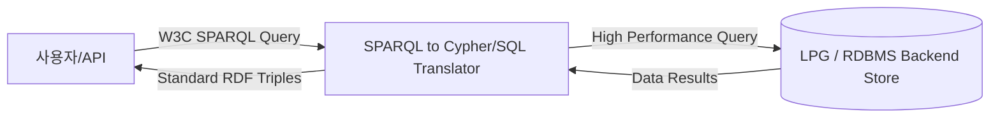

# 온톨로지 표준 아키텍처 심층 분석 (RDF/SPARQL vs LPG)

> **작성자**: Antigravity  
> **작성일**: 2026-05-24  
> **대상**: `X_ont_std` 프로젝트 표준 아키텍처 수립  
> **목적**: RDF/SPARQL 표준 도입의 당위성, 글로벌 솔루션(Palantir, Neo4j)의 팩트 체킹 및 경량 온톨로지 플랫폼을 위한 아키텍처 의사결정 지원  

---

## 1. Graph DB 없이 RDFLib + SPARQL을 쓰는 아키텍처 분석

RDFLib은 파이썬 네이티브 환경에서 RDF 트리클 스토어와 SPARQL 1.1 엔진을 제공하는 라이브러리입니다. 별도의 분산 Graph DB 없이 이 구조를 사용하는 것에는 명확한 트레이드오프가 존재합니다.

### ① 장점 (Pros)
*   **표준화와 이식성(Portability)**: W3C 표준인 **SPARQL 1.1**을 기준으로 코드를 작성하면, 향후 데이터 규모가 커져 상용 Graph DB(예: GraphDB, Stardog 등)로 전환하더라도 백엔드 조회 쿼리 코드를 고칠 필요 없이 그대로 재사용할 수 있습니다.
*   **인프라 오버헤드 제로**: 분산 Graph DB 서버나 무거운 Docker 컨테이너를 띄우지 않아도 되므로, **경량 특화 플랫폼**이라는 목표에 가장 잘 부합합니다.
*   **시맨틱 표현 및 추론(Reasoning) 우수**: 일반 RDBMS나 NoSQL로는 구현하기 매우 어려운 그래프 경로 탐색(Property Path)이나 전이적 관계 추적(Transitive Relation)을 한 줄의 SPARQL 쿼리로 해결할 수 있습니다.

### ② 단점 (Cons)
*   **성능 확장성 한계**: 파이썬 싱글 프로세스(GIL 제약) 내에서 쿼리가 연산되므로, 트리플 수가 약 10만 개를 초과하면 조인(Join) 연산의 부하로 속도가 급격히 떨어집니다.
*   **인메모리 휘발성**: 기본적으로 메모리 상에서 작동하기 때문에 서버가 재시작되면 데이터가 사라집니다. 이를 방지하기 위해 파일(Turtle 등)에 매번 읽고 쓰는 디스크 I/O 병목이 수반됩니다.

> [!TIP]
> **결론**: 데이터가 소규모이고 빠른 PoC가 필요한 현 단계에서는 최고의 선택이지만, 대량 데이터 처리를 고려한 상용화 단계에서는 영속성 DB 레이어와의 결합이 필수적입니다.

---

## 2. 그래프 데이터베이스의 대량 데이터 처리 성능 한계

일반적으로 RDF/SPARQL을 지원하는 그래프 DB들은 대용량 데이터 처리 시 특유의 구조적 병목 현상을 겪게 됩니다.

```
[ 관계형 DB / LPG 모델 ]
선박 노드 [속성 10개 내장] -> 1번의 홉으로 속성 모두 조회 가능 (조인 없음)

[ RDF 트리플 스토어 모델 ]
선박 노드 -> (hasName) -> 선명
       -> (hasWeight) -> 무게   ===> 선박 정보를 다 모으려면 10개의 독립된 트리플을 
       -> (hasLength) -> 길이        상호 "Self-Join" 해야 함 (조인 폭발 ⚠️)
```

### ① 조인 폭발 (Join Explosion)
*   RDF는 데이터를 `주어-서어-목적어`의 트리플 형태로 극단적으로 쪼개어 저장합니다.
*   이로 인해 하나의 엔티티에 속한 10개의 속성을 조회하려 해도 **10번의 셀프 조인(Self-Join)**이 강제됩니다. 데이터 수가 수억 개 단위로 증가하면 이 조인 연산 속도가 기하급수적으로 느려집니다.

### ② 인덱스 비대화 (Index Bloat)
*   조인 성능을 방어하기 위해 거의 모든 트리플 스토어는 데이터의 가능한 모든 순열 패턴(SPO, SOP, PSO, POS, OSP, OPS)에 대해 매우 촘촘한 인덱스를 빌드합니다.
*   이로 인해 **인덱스 크기가 원본 데이터의 3~5배**에 달하며, 새로운 데이터를 집어넣을 때(Write/Update) 인덱스 갱신 속도가 심각하게 저하됩니다.

### ③ 분산 샤딩(Sharding)의 한계
*   그래프 데이터는 연결 관계가 복잡하여 여러 서버로 데이터를 쪼개어 저장(샤딩)할 때 경계가 모호합니다.
*   분산 환경에서 쿼리를 처리할 때 물리 서버 간에 네트워크로 데이터를 맞추어보는 통신 비용(Network Hop)이 매우 커 분산 스케일아웃 효율이 RDBMS나 Document DB에 비해 떨어집니다.

---

## 3. 글로벌 솔루션들의 실제 구현 팩트 체킹

### ① Palantir Foundry (팔란티어)
*   **팩트**: **네이티브 RDF 및 SPARQL을 전혀 지원하지 않습니다.**
*   **분석**: 팔란티어 온톨로지는 학술적인 시맨틱 웹 표준 규격 대신, **객체(Object), 링크(Link), 액션(Action)**으로 이루어진 **독자적인 운영 온톨로지 모델**을 씁니다.
*   **이유**: 대규모 엔터프라이즈 환경에서 페타바이트급 데이터를 지연 없이 조회하고 쓰기(Write-back) 처리를 하기 위해, 무거운 RDF 표준 스택을 버리고 관계형 DB 및 빅데이터 포맷(Parquet, Iceberg)에 매핑된 실용적인 아키텍처를 선택했습니다. 쿼리는 SPARQL 대신 자체 **Ontology SQL**(Spark SQL 기반)이나 TypeScript 함수를 사용합니다.
*   *참고: 기존 작성된 [02_Ontology_Solutions_Compare.md](file:///E:/ontology_edu/X_ont_std/cross-source-comparison/02_Ontology_Solutions_Compare.md)의 "팔란티어의 네이티브 SPARQL 지원" 설명은 잘못 기술되었거나 오해된 내용입니다.*

### ② Neo4j
*   **팩트**: **네이티브 RDF/SPARQL DB가 아닙니다. 단, 플러그인을 통해 변환 수용합니다.**
*   **분석**: Neo4j는 노드 내부에 속성을 보관하는 **LPG(Labeled Property Graph)** 모델입니다. 다만, **neosemantics (n10s)** 플러그인을 통해 외부 RDF 데이터를 임포트할 때 LPG 구조로 자동 파싱·변환하여 수용합니다.
*   **한계**: 데이터를 수용한 뒤 조회할 때는 SPARQL을 쓸 수 없고, Neo4j의 기본 쿼리 언어인 **Cypher**를 써서 조회해야 합니다. 즉, 완벽한 W3C SPARQL 표준 인터페이스 규격을 제공하지는 못합니다.

---

## 4. ont_platform v3의 가짜 구현이 문제가 되는 이유

앞서 팔란티어나 Neo4j가 RDF/SPARQL 표준을 완벽히 쓰지 않고 우회하는 방식을 썼음에도, 클로드가 만든 `ont_platform`에서 RDF/SPARQL 지원이 미진한 점을 단점으로 지적한 이유는 프로젝트의 정체성 및 리소스 한계 때문입니다.

1.  **요구사항 명세 미달**: 이 프로젝트(`X_ont_std`)의 핵심 Phase 4 요구사항이 **"표준 RDF/SPARQL API 제공"**이었기 때문에, 정규식 매칭 수준의 가짜(Mock) 엔진([SPARQLEngine](file:///E:/ontology_edu/X_ont_std/ont_platform/v3/src/backend/app/services/sparql_engine.py#L12) 및 [OntologyImporter](file:///E:/ontology_edu/X_ont_std/ont_platform/v3/src/backend/app/services/ontology_importer.py#L14))은 프로젝트의 핵심 계약 위반이자 기술 부채입니다.
2.  **경량형 오픈소스 혜택 상실**: 팔란티어처럼 자체 엔진과 쿼리 언어를 독자 개발할 자본과 개발진이 부족한 상태에서 W3C 표준마저 가짜로 흉내 내면, 풍부한 기존 시맨틱 웹 오픈소스 라이브러리 및 도구 생태계를 그대로 가져다 쓸 수 없게 됩니다.

---

## 5. 향후 플랫폼 아키텍처 제언



1.  **단기 전략 (표준 보완)**: 현재 클로드의 정규식 기반 모조 파서를 걷어내고, 파이썬의 검증된 오픈소스 라이브러리인 `rdflib`를 백엔드 서비스 계층에 제대로 통합하여 규격에 맞는 Turtle/RDF 파싱과 완벽한 SPARQL 쿼리를 우선 지원해야 합니다.
2.  **중장기 전략 (하이브리드 변환 레이어)**: 대량 데이터의 성능 보장과 팔란티어 급의 쓰기-백(Write-back)을 동시에 충족하기 위해, 저장소 자체는 Neo4j(LPG) 또는 PostgreSQL(RDBMS)을 쓰되, API 게이트웨이 단에서 **SPARQL 쿼리를 Cypher나 SQL로 변환하여 고속 실행해 주는 매핑 레이어(Translator)** 아키텍처를 도입하는 것이 경량 실무 지향형 플랫폼의 가장 현실적인 완성형 모델입니다.
