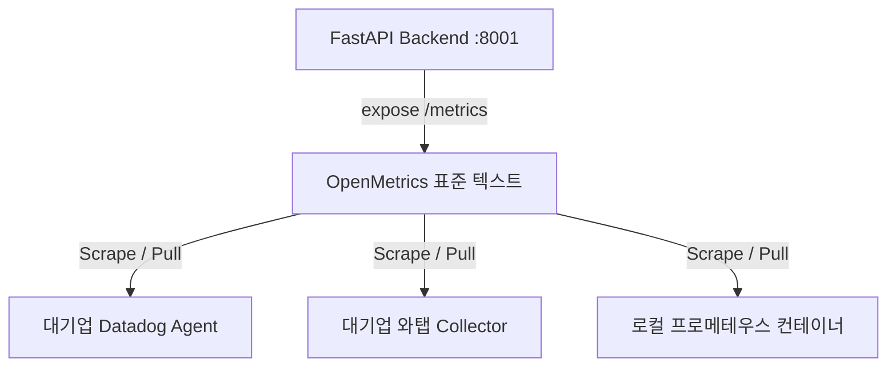

# 05_3 모니터링 및 성능 검증 종합 분석
## 엔터프라이즈 모니터링 현실과 실행형 온톨로지 성능 검증 전략

> **작성자**: Antigravity (성능 및 부하 테스트 담당)  
> **작성일**: 2026-05-25  
> **검토 범위**: 국내 SI/엔터프라이즈 모니터링 환경, OpenMetrics 표준, 프로젝트 내 구축된 성능 인프라  
> **목적**: 대기업 등 현업 엔터프라이즈 환경에서 본 플랫폼이 마주할 모니터링 연동의 실무적 현실을 분석하고, 비용과 관리 공수를 최소화하는 실질적인 성능 검증 전략을 제안한다.

---

## 1. 결론 요약

대기업 등 이미 시스템 모니터링 인프라가 갖추어진 환경에 플랫폼을 공급하거나 배포할 때, 모니터링 설정을 과도하게 개별 구축하는 것은 중복 투자이자 불필요한 관리 공수를 야기한다. 

따라서 본 프로젝트의 모니터링 및 성능 검증 전략은 다음의 두 가지 핵심 원칙을 따른다.

```text
1. [코드 레벨] OpenMetrics 규격의 표준 메트릭(/metrics) 노출
   → 대기업 전사 모니터링 도구(Datadog, WhaTap 등)에 별도 연동 공수 없이 바로 빨대를 꽂아 수집하게 한다.
   
2. [테스트 레벨] 경량 단발성 측정 스크립트(baseline.py) 중심의 로컬 검증
   → 상시 서버 기동 리소스 낭비 없이 개발자가 필요할 때만 1초 만에 성능 변화를 추적한다.
```

---

## 2. 엔터프라이즈 모니터링 환경 비교분석

국내 대기업 및 엔터프라이즈 SI 프로젝트에서는 인프라 성격과 예산에 따라 서로 다른 모니터링 도구를 채택하고 있다.

| 분류 | 대상 도구 | 장점 | 단점 / 한계 | 이 프로젝트에서의 대처 방안 |
|---|---|---|---|---|
| **상용 APM (국내 다수)** | 와탭 (WhaTap), 제니퍼 (Jennifer) | 에이전트 설치가 간편하고, 국내 기술 지원 및 장애 대응이 빠름. | 라이선스 비용 발생, 솔루션 종속성 높음. | 백엔드 코드에 표준 APM 에이전트 연동용 포트와 수집 경로를 확보해 둔다. |
| **글로벌 SaaS형** | Datadog, Dynatrace, New Relic | 클라우드 인프라와 컨테이너 환경에서 독보적인 분석 및 시각화 제공. | 기기/컨테이너 수당 가격이 매우 비싸 개발 서버 연동이 제한됨. | 개발 환경에서는 무료인 프로메테우스/오픈소스로 자체 검증 후, 운영 환경에서 Datadog 연동 규격 호환 적용. |
| **오픈소스 APM / 수집 엔진** | **Prometheus**, **Pinpoint** (네이버 오픈소스), **Elastic Stack** (ELK/APM) | 비용이 없고 커스터마이징이 자유로움. 특히 **Pinpoint**는 분산 서비스 호출 추적에 강력하며 국내 SI에서 인기가 많음. | 구축 및 관리 공수가 큼. Elasticsearch의 경우 리소스 소모가 극심하고 Pinpoint는 에이전트 설정이 다소 무거움. | 로컬 개발 및 한계 부하 테스트 기간에만 선택적(Docker)으로 기동하여 리소스 낭비를 방지함. |
| **오픈소스 표준 프레임워크** | **OpenTelemetry**, **Jaeger** | 특정 솔루션에 종속되지 않는 벤더 중립적 표준 메트릭/트레이싱 포맷. CNCF 표준으로 대형 MSA에서 선호함. | 설정이 복잡하고 데이터를 영구 저장할 별도의 백엔드 데이터베이스를 직접 구성해야 함. | 백엔드 API 라이브러리를 통해 OpenTelemetry 규격의 트레이싱을 준수하여 이식성을 극대화함. |

---

## 3. OpenMetrics 표준 연동의 중요성

대기업의 모니터링 시스템(예: Datadog)을 사용할 때 **프로메테우스 설정이 왜 여전히 유효한가?**에 대한 핵심은 **데이터 표준 포맷**에 있습니다.

현대 모니터링 업계는 **OpenMetrics(프로메테우스 포맷)**를 시계열 데이터 수집 규격의 표준으로 채택하고 있습니다.



1. **상호 운용성 보장**: 
   개발 단계에서 백엔드 서버에 프로메테우스 규격의 메트릭 데이터를 생성해 두면, 고객사의 모니터링 도구가 Datadog이든 와탭이든 상관없이 **동일한 엔드포인트 `/metrics`를 바로 긁어가서 모니터링**할 수 있습니다.
2. **중복 작업 최소화**: 
   특정 모니터링 솔루션 전용 코드를 짤 필요 없이, 표준 규격 하나만 구현해 둠으로써 어떤 대기업 인프라에도 즉시 연동되는 확장성을 확보합니다.

---

## 4. 본 플랫폼의 성능 검증 이원화(Two-track) 전략

관리 공수를 최소화하기 위해 개발 주기와 운영 환경에 맞추어 성능 검증 도구를 구분하여 활용합니다.

### 4.1 [개발 및 기능 검증 단계] 경량 벤치마크 스크립트 활용
* **대상 도구**: [baseline.py](file:///E:/ontology_edu/X_ont_std/ont_platform/v3/tests/load/baseline.py) 및 [test_data.py](file:///E:/ontology_edu/X_ont_std/ont_platform/v3/tests/load/fixtures/test_data.py)
* **운영 방식**: 프로메테우스/그라파나 서버를 띄우지 않고, 필요할 때만 터미널에서 스크립트를 단발성으로 기동.
* **장점**: 
  - 관리 공수 0 (서버 유지보수나 리소스 낭비 없음).
  - 로컬/개발 망에서 쿼리 레이턴시(Cold/Warm 상태 분리)를 빠르게 정량적으로 측정 가능.
  - 빌드 전 정기 테스트 패키지에 포함시켜 성능 저하(Regression) 감지용으로 적합.

### 4.2 [대규모 성능 테스트 및 실운영 단계] 선택적 Docker 모니터링 기동
* **대상 도구**: [prometheus.yml](file:///E:/ontology_edu/X_ont_std/ont_platform/v3/monitoring/prometheus.yml) 설정 기반 Docker 인프라
* **운영 방식**: 대형 릴리스 전 부하 테스트 기간(Stress Test) 또는 고객사 전달용 성능 입증 보고서 작성 시에만 일시적으로 도커 컨테이너를 구동.
* **장점**: 
  - 동시 다발적 쿼리 유입 하에서 CPU, Memory 사용량과의 상관관계를 실시간 대시보드로 시각화하여 설득력 있는 지표 제시 가능.

---

## 5. 결론 및 향후 실천 과제

1. **프로메테우스 포맷 규격 호환**:
   현재 백엔드 서버가 제공하는 `/metrics` 포맷이 표준 규격을 안정적으로 유지하는지 정기 검증합니다.
2. **실측 성능 데이터 업데이트**:
   향후 프론트엔드와 백엔드의 API 통신 규격이 완벽하게 일치되고 안정화되면, `baseline.py`를 활용해 단순 SQL 레이어를 넘어선 **실제 API HTTP 및 네트워크 구간이 포함된 E2E 실측 성능 지표**를 지속적으로 업데이트하고 보고서에 반영합니다.
