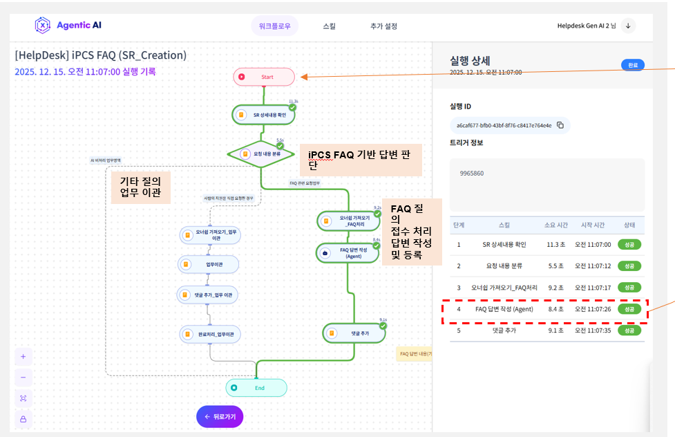
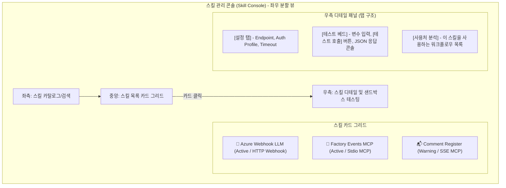
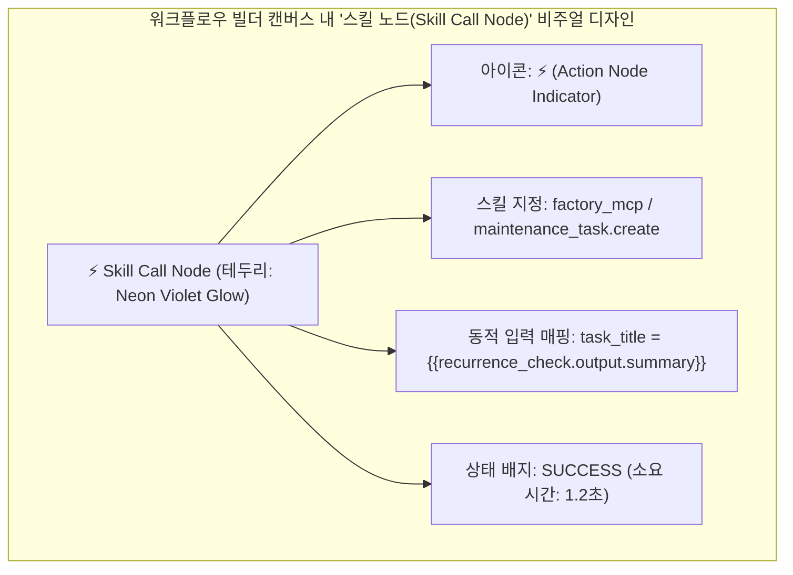

# ont_platform v5 UI/UX 개선안

작성일: 2026-06-13  
작성/정리: Codex  
비고: 기존 문서가 문자 인코딩 깨짐 상태였기 때문에, 기존 주제를 유지하되 워크플로우/온톨로지 UI 개선 관점으로 재작성한 정리본이다.  
대상 범위: `ont_platform/v5` 시나리오 운영 화면, 워크플로우 빌더, 워크플로우 실행, 온톨로지 탐색/Trace 화면  
주요 시나리오: 고객사 자동댓글, 공장 반복 고장 대응

## 1. 개선 목표

현재 `ont_platform v5`는 시나리오 실행 기능은 상당 부분 구현되어 있다.
하지만 사용자가 화면을 볼 때 다음 흐름이 한눈에 연결되어 보이지 않는다.

```text
시나리오 선택
  -> 워크플로우 확인/수정
  -> 실행
  -> 실행 결과 확인
  -> 온톨로지 객체/관계 확인
  -> 외부 시스템 write-back 확인
```

따라서 UI/UX 개선의 목표는 단순히 예쁘게 만드는 것이 아니라, 사용자가 "이 플랫폼이 어떤 업무를 어떻게 처리했고, 그 결과가 어떤 지식으로 남았는지"를 직관적으로 이해하게 만드는 것이다.

핵심 개선 방향:

- 메뉴를 기능 나열이 아니라 업무 흐름 중심으로 재구성한다.
- 워크플로우 빌더를 "편집 화면"이 아니라 "편집 + 실행 + 결과 확인" 화면으로 확장한다.
- 실행 중인 노드가 캔버스에서 명확히 보이게 한다.
- 워크플로우 노드와 온톨로지 객체를 바로 연결한다.
- `Workflow Trace`는 별도 분석 화면으로 유지하되, 빌더에서도 최근 실행 이력을 바로 볼 수 있게 한다.
- 공장/고객 시나리오별로 도메인 맥락이 보이는 카드와 시각 요소를 제공한다.

## 2. 메뉴 구조 개선안

현재 메뉴는 기능 단위로 흩어져 있어 처음 보는 사용자가 어떤 순서로 써야 하는지 알기 어렵다.
메뉴는 "사용자의 작업 순서"를 기준으로 묶는 것이 좋다.

### 2.1 추천 메뉴 그룹

```text
1. 시나리오 운영
   - 시나리오 홈
   - 템플릿 갤러리
   - 워크플로우 빌더
   - 실행 이력

2. 온톨로지 관리
   - 온톨로지 맵
   - 객체 탐색
   - 스키마/매핑 관리

3. 검증/운영
   - Workflow Trace
   - Writeback DLQ
   - 통합 테스트

4. 분석/질의
   - 대시보드
   - 온톨로지 질의
   - 통합 질의
   - 문서 RAG 질의
```

### 2.2 메뉴별 역할

| 메뉴 | 역할 | 핵심 사용자 질문 |
| --- | --- | --- |
| 시나리오 홈 | 전체 시나리오 상태 요약 | 지금 무엇이 준비됐고, 무엇을 실행할 수 있나? |
| 템플릿 갤러리 | 표준 업무 흐름 복제 | 어떤 업무 흐름을 가져와 시작할까? |
| 워크플로우 빌더 | 편집, 실행, 최근 결과 확인 | 이 흐름은 어떻게 구성됐고, 지금 실행하면 어떻게 되나? |
| 실행 이력 | 실행 목록 중심 조회 | 언제 어떤 실행이 성공/실패했나? |
| 온톨로지 맵 | 객체와 관계 시각화 | 업무 결과가 어떤 관계로 저장됐나? |
| 객체 탐색 | 엔티티 상세 조회 | 이 설비/요청/댓글/정비지시는 어떤 속성을 갖나? |
| 스키마/매핑 관리 | 타입과 매핑 관리 | 워크플로우 결과가 어떤 객체 타입으로 저장되나? |
| Workflow Trace | 실행 1건 심층 분석 | 이 실행은 어떤 노드와 객체를 거쳐 처리됐나? |

## 3. 시나리오 홈 개선안

처음 진입 화면은 기능 목록보다 시나리오 카드 중심이 좋다.
사용자는 "무엇을 실행할 수 있는가"를 먼저 알고 싶어 한다.

### 3.1 시나리오 카드 예시

```text
공장 반복 고장 대응
상태: 준비됨
최근 실행: 3분 전 성공
미처리 현장 요청: 12건
생성된 정비지시: 4건
온톨로지 객체: 38개

[워크플로우 열기] [실행] [Trace 보기] [온톨로지 보기]
```

```text
고객사 자동댓글
상태: 준비됨
최근 실행: 1분 전 성공
미처리 문의: 3건
등록 댓글: 2건
MCP 상태: 정상

[워크플로우 열기] [실행] [Trace 보기] [게시판 열기]
```

### 3.2 카드에서 바로 보여줄 지표

- 최근 실행 상태
- 미처리 요청 수
- 성공/실패 건수
- 외부 MCP 연결 상태
- 온톨로지 write-back 건수
- 마지막 오류 메시지

## 4. 워크플로우 빌더 개선안

워크플로우 빌더는 현재 캔버스 중심이지만, 운영 관점에서는 다음 네 가지가 한 화면에 있어야 한다.

```text
왼쪽: 노드 팔레트 / 템플릿 단계
중앙: 워크플로우 캔버스
오른쪽: 속성 / 실행 / 온톨로지 / 이력 패널
하단 또는 우측: 실행 로그 요약
```

### 4.1 우측 패널 탭 구조

우측 패널을 단일 속성 패널이 아니라 탭 구조로 바꾼다.

```text
[속성] [실행] [온톨로지] [이력]
```

#### 속성 탭

- 노드 이름
- 노드 설명
- 실행 조건
- 프롬프트/규칙
- 입력값/출력값
- 연결된 외부 tool

#### 실행 탭

- 실행 모드: `dry_run` / `post`
- 대상 상태: `open`
- 처리 제한 건수
- 강제 재처리 여부
- Run 버튼
- 현재 실행 상태
- 실시간 로그

#### 온톨로지 탭

- 이 노드가 읽는 객체 타입
- 이 노드가 생성/수정하는 객체 타입
- 생성되는 관계
- 실제 실행 후 연결된 엔티티
- `객체 탐색에서 보기`
- `온톨로지 맵에서 강조`

#### 이력 탭

- 최근 실행 목록
- 성공/실패 상태
- 처리 건수
- 댓글/정비지시 등록 결과
- `Trace 보기` 버튼

### 4.2 Workflow Trace와 Builder의 역할 분리

`Workflow Trace`만 실행 결과를 보여주는 구조는 운영 UX가 약하다.
실행한 사람이 즉시 결과를 봐야 하기 때문이다.

권장 역할:

```text
Workflow Builder
  - 워크플로우 만들기
  - 수정
  - 실행
  - 실행 중 상태 확인
  - 최근 실행 결과 확인

Workflow Trace
  - 특정 실행 1건 심층 분석
  - 워크플로우 단계와 온톨로지 객체 관계를 크게 보기
  - 시연/감사/디버깅용 상세 화면
```

즉, 빌더에는 "최근 실행 이력"이 있어야 하고, Trace는 상세 보기로 연결되는 구조가 좋다.

예시:

```text
최근 실행 이력
2026-06-13 21:10 성공  댓글 3건 / 정비지시 2건  [Trace 보기]
2026-06-13 21:05 실패  MCP timeout             [Trace 보기]
```

## 5. 워크플로우 노드 디자인 개선안

현재 노드는 작은 라벨 박스처럼 보여 업무 단계의 의미가 약하다.
노드는 "업무 카드"처럼 보여야 한다.

### 5.1 노드 카드 구성

각 노드는 다음 요소를 포함한다.

```text
아이콘
단계명
짧은 설명
Input / Output
상태 배지
실행 시간
```

예시:

```text
반복 여부 확인
같은 설비/같은 고장 메시지 발생 횟수 확인
Input: FaultEvent
Output: repeated=true
SUCCESS · 1.2s
```

### 5.2 상태별 시각 표현

| 상태 | 표현 |
| --- | --- |
| 대기 | 회색 테두리 |
| 실행 중 | 파란 테두리, pulse 효과, animated edge |
| 성공 | 초록 테두리, 체크 아이콘 |
| 실패 | 빨간 테두리, 오류 아이콘 |
| 스킵 | 회색 점선 테두리 |

### 5.3 실행 중 자동 포커스

Run을 누르면 현재 실행 중인 노드로 캔버스가 자동 이동하거나 강조되어야 한다.

필요 기능:

- 현재 노드 자동 중앙 정렬
- 현재 노드 주변 강조 효과
- 현재 edge animation
- 우측 실행 로그 자동 스크롤

## 6. 공장 시나리오 전용 노드 아이디어

공장 자동화 시나리오는 도메인 맥락이 중요하다.
일반적인 `Request Input`, `Intent Classify`보다 현장 용어가 보이는 것이 좋다.

| 노드 | 표시명 | 아이콘 방향 |
| --- | --- | --- |
| `request-input` | 현장 요청 입력 | inbox |
| `category-classify` | 고장/품질 분류 | tags |
| `asset-map` | 공장-라인-설비 매핑 | network |
| `recurrence-check` | 반복 여부 확인 | repeat |
| `fault-register` | 고장 상황 등록 | alert |
| `maintenance-task` | 정비팀 확인 건 생성 | wrench |
| `quality-link` | 품질 문제 연결 | badge-alert |
| `draft-response` | 현장 안내 답변 생성 | message |
| `notify-teams` | 정비/품질팀 알림 | bell |
| `ontology-write` | 온톨로지 저장 | database |

## 7. 온톨로지 연결 UX

워크플로우와 온톨로지가 연결되어 있다는 점이 이 솔루션의 핵심이다.
따라서 사용자는 워크플로우 노드에서 바로 온톨로지 객체로 이동할 수 있어야 한다.

### 7.1 노드 선택 시 온톨로지 탭

노드를 선택하면 우측 `온톨로지` 탭에 다음을 보여준다.

```text
이 단계가 다루는 객체
- Equipment: 배터리 탭 용접기
- FaultEvent: 압력이 낮습니다
- MaintenanceTask: 정비팀 확인 건

생성/수정 관계
- FaultEvent reports Equipment
- FaultEvent creates MaintenanceTask

[객체 탐색에서 보기] [온톨로지 맵에서 강조]
```

### 7.2 객체 탐색으로 이동

`객체 탐색에서 보기` 버튼을 누르면 다음 형태로 이동한다.

```text
/ontology/explorer?doc=factory-repeated-faults&id=fault-...
```

이동 후:

- 해당 엔티티 자동 선택
- 상세 패널 열림
- 관계 목록 표시
- 연결된 워크플로우 실행 ID 표시

### 7.3 온톨로지 맵에서 강조

`온톨로지 맵에서 강조` 버튼을 누르면:

- 해당 엔티티를 중앙으로 이동
- 관련 노드 1-hop 또는 2-hop 강조
- 관련 없는 노드는 흐리게 처리
- 오른쪽 상세 패널에 속성 표시

## 8. Workflow Trace 개선안

Workflow Trace는 별도 메뉴로 유지하되, "상세 분석 화면"으로 역할을 명확히 한다.

### 8.1 Trace 화면 구성

```text
상단: 워크플로우 / 실행 회차 선택
왼쪽: 실행 단계 리스트
중앙: 온톨로지 흐름
오른쪽: 선택 객체 상세
하단: 외부 write-back / MCP 호출 로그
```

### 8.2 Trace에서 보여줄 핵심 정보

- 실행 ID
- 실행자
- 실행 모드: `dry_run` / `post`
- 처리 건수
- 성공/실패/스킵 건수
- 생성된 댓글 ID
- 생성된 정비지시 ID
- 생성/수정된 온톨로지 객체
- MCP 호출 결과

### 8.3 Trace와 Builder 연결

Builder의 이력 탭에서 `Trace 보기`를 누르면 해당 실행 ID로 Trace 화면을 연다.

```text
/workflow-trace?graph_id=wfg-xxx&run_id=run-xxx
```

## 9. 온톨로지 관리자 개선안

온톨로지 관리 화면은 "스키마 관리자", "객체 탐색", "관계 그래프"가 서로 연결되어야 한다.

### 9.1 스키마/매핑 관리

보여줄 내용:

- 매핑 ID
- 대상 워크플로우 executor
- 대상 온톨로지 문서
- 생성 엔티티 타입
- 생성 관계 타입
- 설치 여부
- 마지막 수정일

공장 시나리오 예:

```text
mapping_id: factory.repeated_fault_response.v1
executor: factory.repeated_fault_response
doc_id: factory-repeated-faults
entities: Factory, ProductionLine, Equipment, FaultEvent, MaintenanceTask, QualityIssue
relations: has_line, uses, reports, affects, creates, possibly_caused_by
```

### 9.2 객체 탐색

개선 방향:

- 문서 선택: `service-requests`, `factory-repeated-faults`
- 타입 필터: Equipment, FaultEvent, MaintenanceTask 등
- 검색
- 선택 엔티티 상세
- 연결 관계 표시
- 연결된 워크플로우 실행 이력 표시

### 9.3 관계 그래프

개선 방향:

- 자동 레이아웃 개선
- 노드 겹침 방지
- 드래그 이동 가능
- 타입별 색상과 아이콘
- 관계 라벨 가독성 개선
- 선택 노드 중심 1-hop/2-hop 보기
- 미니맵과 줌 컨트롤 정리

## 10. 비주얼 스타일 방향

업무용 SaaS/운영 도구에 가까우므로 지나치게 화려한 랜딩 페이지 스타일은 피한다.
대신 정보 밀도와 상태 가시성을 높이는 방향이 좋다.

### 10.1 권장 스타일

- 차분한 배경
- 카드 반경은 작게
- 노드 타입별 색상은 명확하게
- 실행 상태 색상은 일관되게
- 아이콘은 lucide 계열 사용
- 텍스트는 작지만 읽기 쉽게
- 캔버스는 넓고 깨끗하게
- 우측 패널은 밀도 있게

### 10.2 색상 체계

| 용도 | 색상 방향 |
| --- | --- |
| 실행 중 | Blue |
| 성공 | Green |
| 실패 | Red |
| 경고 | Amber |
| 온톨로지 저장 | Slate / Indigo |
| 외부 MCP 호출 | Teal |
| 정비/설비 | Orange |
| 품질 | Rose / Fuchsia |

## 11. 참고할 만한 제품

| 제품 | 참고 포인트 |
| --- | --- |
| n8n | 실행 이력, 노드별 입출력 확인, 과거 실행 재현 |
| Dify | AI 워크플로우 빌더, 실행 중 단계 표시 |
| Flowise | React Flow 기반 AI 노드 빌더 구성 |
| Langflow | 노드 카드와 연결선 가독성 |
| Palantir Foundry | 온톨로지 객체 중심 탐색, lineage, 운영 데이터 연결 |
| 필라넷 (Philanet) | 분할 뷰(Split View) 기반 실행 기록 및 세부 스킬 일람 구조 |

### 11.1 필라넷 (Philanet) 워크플로우 벤치마킹 분석



#### A. 벤치마킹 핵심 요소
* **좌우 분할 뷰(Split-view) 레이아웃**:
  * 화면의 60%를 차지하는 좌측 영역은 React Flow 기반의 실행 토폴로지(실행 완료된 성공 노드는 녹색 체크 배지와 소요 시간 명기)를 보여줍니다.
  * 우측 40% 영역은 실행 세부 요약(실행 ID, 시작 일시, 트리거 정보, 단계별 소요 시간 및 성공 여부 일람 테이블)을 보여주어 시인성이 높습니다.
* **사용자 액션 분리**:
  * 하단에 '뒤로가기' 배치 등 단일 테넌트 내에서의 이탈/디버깅 동선이 직관적입니다.

#### B. ont_platform v5의 초격차 개선안 (필라넷 대비 우위 확보 전략)
필라넷의 레이아웃을 적극 수용하되, 지식 모델링(Ontology)과 양방향 연동이라는 우리만의 고유 가치를 결합하여 더 진보된 형태를 완성합니다.

1. **온톨로지(Ontology) 데이터 드릴다운(Drill-down)**:
   * 필라넷은 단순 스킬 실행 여부만 표기하지만, 우리는 실행 결과로 생성된 온톨로지 인스턴스(예: `FaultEvent`, `MaintenanceTask` 등)를 클릭하면 우측 탭에서 해당 객체의 연결 족보(Lineage) 및 Properties 정보를 바로 조회하고 객체 탐색기(Explorer)로 이동할 수 있는 **지식 연동성**을 구축합니다.
2. **실행 시점의 데이터 복원 (Back-tracing)**:
   * 우측 테이블의 특정 스텝을 클릭하면, 당시 단계에 인입되었던 실제 Input/Output JSON 변수 값(Payload)이 캔버스 노드 팝업창에 자동으로 복원 렌더링되게 하여 디버깅 편의성을 필라넷 이상으로 향상시킵니다.
3. **편집(Builder)과 실행(Run)의 동적 스위칭 (2-Way Context Panel)**:
   * 실행 이력 조회 전용 화면을 빌더 내로 완전히 통일하여, 빌더 화면에서 Run 버튼 클릭 시 실시간 로그와 변수가 우측 패널로 자연스럽게 오가는 통합 조종석(Cockpit)으로 개발합니다.

참고할 때 중요한 점은 외형을 그대로 따라 하는 것이 아니라, 다음 UX 원칙을 가져오는 것이다.

- 사용자는 실행 흐름을 잃지 않아야 한다.
- 노드 실행 결과는 노드 옆에서 확인되어야 한다.
- 객체/관계 데이터는 별도 DB처럼 숨겨지면 안 된다.
- 실행 결과에서 온톨로지 객체로 바로 이동할 수 있어야 한다.

### 11.2 에이전트 스킬 (Skill / Tool) 및 MCP 연동 UI/UX 개선안 및 벤치마킹 레퍼런스

스킬(Skill)은 에이전트나 워크플로우가 작업을 수행할 때 사용하는 기능적 API 블록(예: `comment.create`, `maintenance_task.create`, `azure_webhook_skill` 등)입니다. 복잡한 외부 연동 도구들을 효율적으로 관리하고 결합하기 위해 다음 5가지 핵심 UI/UX 설계 요소를 제안합니다.

#### A. 핵심 UI/UX 설계 제안

1. **스킬 카탈로그 & 상태 모니터링 (Skill Registry Grid)**:
   * 스킬들을 카테고리별(DB 처리, 메신저 알림, AI 추론, 외부 MCP 어댑터 등)로 분류한 카드 대시보드를 제공합니다.
   * 각 카드에는 연결 유형(표준 MCP stdio, MCP SSE, custom HTTP Webhook)과 실시간 연결성/헬스 체크 상태(정상 작동: 녹색 펄스, 미설정/인증 유실: 회색, 통신 장애: 적색 경고)를 표시하여 통합 상태를 한눈에 관제합니다.
2. **동적 파라미터 맵핑 및 스키마 기반 폼 (Dynamic Parameter & Schema-based Form)**:
   * 워크플로우 빌더 내에서 `skill_call` 노드를 선택했을 때, 우측 속성 패널에서 특정 스킬을 지정하면 해당 스킬의 `input_schema`를 기반으로 입력 GUI 폼이 동적으로 생성(Auto-generated Form)되어야 합니다.
   * 단순 텍스트 입력창 외에도, 이전 노드의 출력 데이터(예: `{{node_1.output.text}}` 또는 `{{intent_classify.intent}}`)를 쉽게 바인딩할 수 있는 드롭다운 변수 선택기(Autocomplete Variable Picker)를 제공하여 오타를 방지하고 편의성을 높입니다.
3. **간이 샌드박스 테스팅 도구 (Live Sandbox Test-bed)**:
   * *가장 중요한 UX 요소*로, 스킬을 워크플로우 캔버스에 직접 배치하여 사용하기 전에, 파라미터 값(Arguments)을 UI에서 직접 테스트 입력하고 **[테스트 실행]** 버튼을 눌러 JSON 응답 결과, HTTP 요청/응답 헤더, 처리 시간(latency), 디버깅용 HTTP 오류 로그를 즉시 확인해볼 수 있는 디버깅 패널을 제공합니다.
4. **인증 자격 증명 관리 및 보안 가이드 (Credentials Wizard)**:
   * API Key, Bearer Token, OAuth2, HMAC Signature 등 다양한 외부 인증 설정을 친절하게 가이드해 주는 스텝 바이 스텝 입력 폼을 제공합니다.
   * 보안이 필요한 Secret 정보는 UI 상에서 마스킹(`••••••••`) 처리하되, "자격 확인(Validate Connection)" 버튼을 통해 연결 성공 여부만 시각적으로 피드백합니다.
5. **역방향 사용처 분석 (Reverse Usage Tracker / Lineage)**:
   * 특정 스킬 상세 페이지 내에서 "이 스킬이 현재 어떤 시나리오(워크플로우)의 몇 번 노드에서 참조되어 작동 중인지" 역방향 사용 족보(Lineage) 링크를 제공하여 무분별한 변경으로 인한 시스템 오류(Breakage)를 미연에 방지합니다.

#### B. 대표 벤치마킹 레퍼런스 및 핵심 기능 분석

* **Dify (Tools / Custom Tool)**:
  * *벤치마킹 포인트*: OpenAPI(Swagger JSON/YAML) 스키마를 붙여넣기만 하면, 입력/출력 매개변수와 설명을 자동으로 파싱하고 UI 입력 폼으로 즉시 변환해 주는 자동 파싱 마법사. 아이콘 커스터마이징 및 에러 핸들링 기본값 정의 기능이 매우 우수합니다.
* **Coze (Plugin Console & Test Panel)**:
  * *벤치마킹 포인트*: 플러그인 콘솔 내에서 각 스킬 단위로 우측 슬라이딩 패널을 제공하여, 임의의 매개변수를 입력하고 간이로 API 실행을 테스트해 보는 테스트 베드 패널 구성이 직관적입니다.
* **n8n (Credential Manager & Dynamic Mapping)**:
  * *벤치마킹 포인트*: 외부 서비스 연동 시 인증(OAuth/Token) 연동 과정을 시각화하여 사용자가 직관적으로 계정을 연결하고 관리하게 돕는 플로우. 또한, 왼쪽 패널에 이전 노드의 JSON 구조가 Tree 뷰로 표시되어 드래그 앤 드롭으로 변수 값을 입력 칸에 매핑하는 UI/UX가 세계 최고 수준입니다.
* **Anthropic MCP Inspector (Developer Debugging Console)**:
  * *벤치마킹 포인트*: MCP stdio 및 SSE 서버를 직접 연결하여 등록된 도구(Tools)의 목록, 입력 스키마, 리소스(Resources), 프롬프트(Prompts)를 트리 뷰로 탐색하고, GUI 환경에서 도구를 직접 호출하여 결과(텍스트/이미지 등)를 실시간으로 확인하는 개발자 친화적 경량 디버거 환경입니다.

#### C. 스킬 UI/UX 핵심 렌더링 컨셉 (Mermaid Visualization)





## 12. 단계별 구현 우선순위

### Phase 1. 바로 체감되는 개선

- 워크플로우 노드 라벨/카드 디자인 개선
- 실행 중 노드 상태 표시 강화
- 우측 패널 탭 구조 도입: 속성/실행/이력
- 실행 결과를 Builder 안에서 바로 표시
- 공장/고객 시나리오별 한글 라벨 정리

### Phase 2. 온톨로지 연결 강화

- 노드 선택 시 연결 온톨로지 객체 표시
- `객체 탐색에서 보기` 버튼
- `온톨로지 맵에서 강조` 버튼
- Workflow Trace deep link
- 실행 이력에서 Trace 바로가기

### Phase 3. 화면 구조 재편

- 메뉴 그룹 재구성
- 시나리오 홈 추가
- 실행 이력 전용 화면 정리
- 온톨로지 관리자 화면 통합
- 관계 그래프 레이아웃 개선

### Phase 4. 운영 완성도

- MCP 연결 상태 표시
- 실패 원인 요약
- 재실행 버튼
- dry_run/post 차이 명확화
- tenant/company/project 전환 UX 개선
- 시나리오별 운영 대시보드

## 13. 추천 구현 순서

가장 먼저 할 일은 `Workflow Builder` 개선이다.
이 화면이 시연과 운영의 중심이기 때문이다.

추천 순서:

1. 워크플로우 노드 카드 디자인 개선
2. 실행 중 상태 표시와 자동 포커스
3. 우측 패널을 `속성/실행/이력` 탭으로 분리
4. 실행 이력에서 `Trace 보기` 연결
5. 노드 선택 시 온톨로지 객체 표시
6. 객체 탐색/온톨로지 맵 deep link
7. 메뉴 그룹 재구성
8. 시나리오 홈 추가

## 14. 기획 결론

`Workflow Trace`만으로 실행 결과를 보여주는 것은 좋은 기획이 아니다.
Trace는 상세 분석용으로 필요하지만, 실행자는 Builder 안에서 즉시 결과를 봐야 한다.

권장 화면 역할은 다음과 같다.

```text
Workflow Builder
  = 업무 흐름을 만들고 실행하는 조종석

Workflow Trace
  = 실행 결과를 단계와 온톨로지 관계로 분석하는 분석실

객체 탐색 / 온톨로지 맵
  = 실행 결과가 축적된 업무 지식 저장소

시나리오 홈
  = 전체 시나리오 운영 상태를 보는 관제판
```

이 방향으로 개선하면 고객에게 "자동댓글을 단다" 수준이 아니라, "업무 실행 결과가 온톨로지 지식으로 축적되고, 다시 다음 워크플로우 판단에 쓰인다"는 메시지를 훨씬 직관적으로 보여줄 수 있다.
