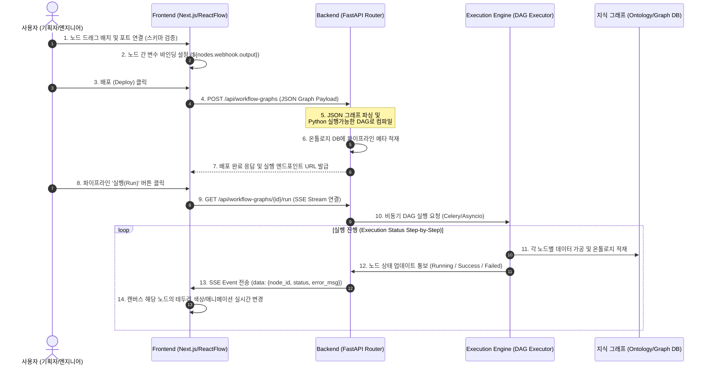

# 파이프라인 빌더 고도화 설계서 (Pipeline Builder Advanced Architecture Design)

**작성자**: Antigravity (AI Coding Assistant)  
**작성일**: 2026-06-14  
**대상 시스템**: `ont_platform/v5`  
**문서 번호**: `design/AI코딩에이전트/10_파이프라인_빌더_고도화_설계서.md`

---

## 1. 개요 및 배경

현재 플랫폼의 파이프라인 빌더는 ReactFlow 기반으로 데이터를 수집, 가공, 적재하는 컴포넌트를 드래그 앤 드롭하고 저장(배포)하는 기본적인 시각화 기능(MVP)을 갖추고 있습니다. 

본 고도화 설계서는 MVP 단계를 넘어 실제 엔터프라이즈 환경에서 데이터 계보(Data Lineage)를 추적하고, 자료형 검증(Schema Validation), 매개변수 매핑(Variable Passing), 그리고 실행 엔진과의 긴밀한 실시간 모니터링 연동을 보장하는 **운영 수준(Production-grade)의 파이프라인 빌더 설계**를 목적으로 합니다.

---

## 2. 고도화 목표 (Key Objectives)

1. **UX 최적화 및 프리미엄 디자인**: 노드 종류별 독자적 커스텀 디자인(아이콘, 포트 광원 효과) 및 그리드 스냅, 선 끝 화살표 마커 처리.
2. **엄격한 스키마 검증 (Schema Matching)**: 노드를 연결할 때 상위 노드의 출력 자료형(예: HTML, Text)과 하위 노드의 입력 요구 조건(예: JSON, List)을 비교하여 맞지 않는 연결은 사전에 차단.
3. **노드 매개변수 매핑 (Variable Passing)**: 상위 노드의 실행 결과 변수를 하위 노드의 매개변수(예: `${webhook.body.message_text}`)로 동적 바인딩하는 속성 UI 지원.
4. **실시간 실행 추적 (Live Tracing)**: 실제 파이프라인 작동 시 가동 중인 노드(Pulsing Teal), 성공한 노드(Solid Green), 실패한 노드(Red)를 시각적으로 하이라이트하고 예외 스택 트레이스 연결.
5. **백엔드 DAG 컴파일 및 모니터링 엔진 연동**: ReactFlow JSON 그래프를 Python 비동기 스케줄러(또는 Airflow/Celery)가 실행할 수 있는 실행형 DAG 파일로 자동 컴파일 및 실행 상태를 SSE(Server-Sent Events)로 수신.

---

## 3. 전체 시스템 아키텍처

파이프라인 빌더의 편집, 저장(컴파일), 실행, 그리고 실시간 추적의 흐름은 다음과 같은 다이어그램 구조로 동작합니다.



---

## 4. 핵심 영역별 세부 설계 Specification

### 4.1 Frontend 커스텀 노드 디자인 (Custom Node Component)

ReactFlow의 기본 노드(Default Node)를 대체하기 위해 독자적인 `<PipelineCustomNode />` 컴포넌트를 설계합니다.

```typescript
// Frontend Custom Node Component 예시 구조
import React from 'react';
import { Handle, Position } from 'reactflow';

export function PipelineCustomNode({ data, isSelected }) {
  const { category, label, type, status, config } = data;
  
  // 상태에 따른 애니메이션 클래스 선택
  let statusRing = '';
  if (status === 'running') statusRing = 'animate-pulse ring-4 ring-teal-400';
  else if (status === 'success') statusRing = 'ring-2 ring-emerald-500';
  else if (status === 'failed') statusRing = 'ring-2 ring-rose-500';

  return (
    <div className={`w-52 rounded-xl border bg-white dark:bg-slate-900 shadow-lg ${statusRing} ${
      isSelected ? 'border-teal-500 shadow-teal-150' : 'border-slate-200 dark:border-slate-800'
    }`}>
      {/* 노드 카테고리 헤더 */}
      <div className={`px-3 py-1.5 rounded-t-xl text-[9px] font-extrabold tracking-wider text-white ${
        category === 'source' ? 'bg-emerald-650' :
        category === 'transform' ? 'bg-indigo-650' :
        category === 'execute' ? 'bg-cyan-650' : 'bg-amber-650'
      }`}>
        {category.toUpperCase()}
      </div>

      {/* 노드 본체 */}
      <div className="p-3">
        <div className="text-xs font-bold text-slate-800 dark:text-slate-200 truncate">{label}</div>
        <div className="text-[10px] text-slate-400 font-mono mt-1 truncate">{type}</div>
      </div>

      {/* 포트 연결점 (Handles) */}
      <Handle 
        type="target" 
        position={Position.Left} 
        className="w-3 h-3 bg-slate-400 hover:bg-teal-500 transition border-2 border-white rounded-full -left-1.5"
      />
      <Handle 
        type="source" 
        position={Position.Right} 
        className="w-3 h-3 bg-slate-400 hover:bg-teal-500 transition border-2 border-white rounded-full -right-1.5"
      />
    </div>
  );
}
```

### 4.2 스키마 일치 여부 검증 규칙 (Schema Validation)

엣지(Edge) 연결 요청 시(`onConnect` 이벤트 발생 시) 아래 로직을 통해 호환되지 않는 노드 간 연결을 사전에 방지합니다.

```typescript
const checkSchemaCompatibility = (sourceType: string, targetType: string): boolean => {
  const schemaRegistry = {
    'request_input': { output: 'text' },
    'intent_classify': { input: 'text', output: 'intent_object' },
    'equipment_map': { input: 'text', output: 'equipment_uri' },
    'recurrence_check': { input: 'equipment_uri', output: 'boolean' },
    'knowledge_lookup': { input: 'text', output: 'document_chunks' },
    'draft_response': { input: 'document_chunks', output: 'text' },
    'customer_mcp_comment_create': { input: 'text', output: 'mcp_response' },
    'ontology_write': { input: 'any', output: 'void' }
  };

  const sourceOut = schemaRegistry[sourceType]?.output || 'any';
  const targetIn = schemaRegistry[targetType]?.input || 'any';

  if (sourceOut === 'any' || targetIn === 'any') return true;
  return sourceOut === targetIn;
};

// onConnect 핸들러 내 검증 연동
const onConnect = useCallback((params) => {
  const sourceNode = nodes.find(n => n.id === params.source);
  const targetNode = nodes.find(n => n.id === params.target);
  
  if (sourceNode && targetNode) {
    const compatible = checkSchemaCompatibility(sourceNode.data.type, targetNode.data.type);
    if (!compatible) {
      setMessage({ type: 'error', text: '경고: 연결하려는 두 노드의 데이터 타입이 호환되지 않습니다.' });
      return; // 엣지 추가 거부
    }
  }
  setEdges((eds) => addEdge({ ...params, animated: true }, eds));
}, [nodes, setEdges]);
```

### 4.3 매개변수 참조 변수 바인딩 (Variable Passing)

우측 속성 패널에서 사용자가 상위 노드의 아웃풋 변수를 문자열 템플릿 형태로 참조하여 매핑할 수 있게 합니다.

- **표현식 규칙**: `${node_id.output_field}`
- **파라미터 입력창 예시**:
  - `intent_classify` 노드의 시스템 프롬프트:
    > "고객의 문의 사항은 다음과 같습니다: `${request-input.body.message_text}`. 이 글의 감정과 핵심 장비를 분류하시오."
  - `customer_mcp_comment_create` 노드의 내용:
    > "생성된 AI 자동 답변: `${draft-response.answer}`"

---

### 4.4 백엔드 컴파일러 구현 (Backend DAG Compiler)

백엔드 서버는 프론트엔드가 보낸 ReactFlow JSON 구조를 바탕으로 실행 순서가 정리된 DAG(Directed Acyclic Graph) 실행 트리를 생성합니다.

1. **위상 정렬 (Topological Sort)**: 진입차수가 0인 노드(Source)부터 진출 차수를 따라 정렬하여 실행 순서 배열을 도출.
2. **런타임 컨텍스트 바인딩**: 선행 노드의 실행 결과를 전역 `Context` 맵에 키(Node ID) 값으로 기재하고, 후행 노드 실행 전 `${...}` 참조 구문을 실제 텍스트 값으로 치환.

```python
# Backend Compiler pseudocode
class PipelineExecutor:
    def __init__(self, graph_json):
        self.nodes = {n['id']: n for n in graph_json['nodes']}
        self.edges = graph_json['edges']
        self.context = {}

    def resolve_variables(self, text: str) -> str:
        # "${node_id.field}" 패턴을 찾아 self.context에서 실제 값 추출 후 치환
        import re
        pattern = r"\$\{([^}]+)\}"
        def replacer(match):
            path = match.group(1).split('.')
            node_id = path[0]
            val = self.context.get(node_id, {})
            for step in path[1:]:
                val = val.get(step, {})
            return str(val) if val else match.group(0)
        return re.sub(pattern, replacer, text)

    async def execute_node(self, node_id: str):
        node = self.nodes[node_id]
        node_type = node['type']
        config = node['data']['config']
        
        # 1. 입력 변수 치환
        resolved_config = {k: self.resolve_variables(v) if isinstance(v, str) else v 
                           for k, v in config.items()}
        
        # 2. 실행 분기
        result = {}
        if node_type == 'intent_classify':
            result = await run_llm_classify(resolved_config)
        elif node_type == 'knowledge_lookup':
            result = await search_rag_database(resolved_config)
        # ... 기타 노드 타입별 구현체 호출
        
        # 3. 컨텍스트 업데이트
        self.context[node_id] = result
        return result
```

---

## 5. 단계별 로드맵 (Implementation Plan)

- **[1단계] UI/UX 리디자인 및 그리드 스냅**:
  - ReactFlow 커스텀 노드 클래스 적용.
  - 화살표 형태 마커 및 그리드 스냅 픽셀 정렬 기능 구현.
- **[2단계] 변수 자동 완성 및 스키마 검증**:
  - 엣지 커넥션 시 `checkSchemaCompatibility` 연동.
  - 속성 입력 폼에서 `${` 입력 시 이전 노드들 리스트를 보여주는 자동완성 드롭다운 UI 구현.
- **[3단계] 백엔드 실시간 실행 추적 연동**:
  - FastAPI SSE 스트림 라우터 구축.
  - 실행 엔진의 각 스텝 실행 시 상태 업데이트 발행.
  - 프론트엔드가 EventSource를 통해 캔버스 내부 노드 상태 실시간 업데이트.
