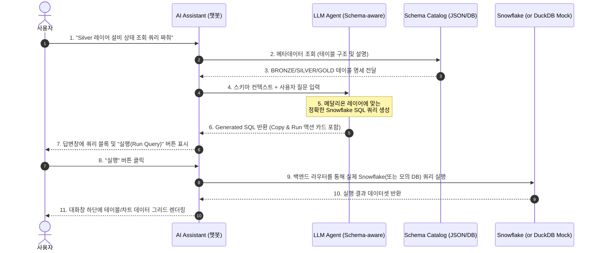

# 메달리온 아키텍처 기반 테이블 및 쿼리 관리 설계서 (DEPRECATED)

> ⚠️ **이 문서는 더 이상 사용되지 않습니다.**  
> **대신 [11_데이터_추상화_계층_설계_및_메달리온_비교.md](../11_데이터_추상화_계층_설계_및_메달리온_비교.md)를 참고하세요.**
>
> **변경 사유:**
> - 메달리온(Bronze/Silver/Gold)은 저장소 비용 3배 증가
> - 온톨로지 플랫폼의 특성(의미론적 계층)과 맞지 않음
> - Snowflake View 기반 추상화 계층이 더 효율적 (저장소 50% 절감)
> - 모든 환경(Dev/Stag/Prod)에서 일관된 뷰 사용 가능

---

## 1. 개요 및 설계 방향

본 문서의 목적은 플랫폼 AI Assistant(챗봇)가 데이터 웨어하우스(예: Snowflake, BigQuery)의 **메달리온 아키텍처(Bronze ➡️ Silver ➡️ Gold) 사상**을 이해하고, 테이블 목록(메타데이터) 관리 및 시각적 쿼리 생성을 수행할 수 있는 확장 인터페이스를 설계하는 데 있습니다.

이 고도화가 적용되면 사용자는 챗봇을 통해 "Silver 레이어의 설비 테이블에서 7일간 반복 고장 횟수가 3회 이상인 장비를 조회하는 SQL을 짜줘"라고 요청하고, 챗봇이 Snowflake SQL을 즉시 생성하여 시각화하고 실행해 볼 수 있는 환경을 갖추게 됩니다.

---

## 2. 메달리온(Medallion) 테이블 구조 정의

데이터의 정제 수준과 결합 형태에 따라 3가지 물리/논리 레이어로 테이블을 격리 관리합니다.

```text
  [ Ingestion ]
       │
       ▼
┌──────────────┐
│  BRONZE      │ ──> 원천 날 것(Raw)의 데이터 적재 (JSON/반정형)
│  (Raw DB)    │     예: src_factory_events (게시글 원본, 수집 로그)
└──────┬───────┘
       │
       ▼ [가공/매핑: 정제, 비즈니스 키 결합]
┌──────────────┐
│  SILVER      │ ──> 구조화, 표준화, 온톨로지 키 매핑 완료 (정형 관계형)
│  (Cleaned)   │     예: tb_equipment_status, tb_fault_incidents
└──────┬───────┘
       │
       ▼ [집계/요약: 분석 목적마트]
┌──────────────┐
│  GOLD        │ ──> 특정 도메인/BI 비즈니스 목적의 집계 마트
│  (Analytics) │     예: gold_daily_equipment_metrics (일별 고장율, 정비 비용)
└──────────────┘
```

### 2.1 테이블 메타데이터 카탈로그 스키마 (Snowflake-like)
챗봇이 스키마를 이해할 수 있도록 백엔드 카탈로그 DB에서 다음과 같은 메타데이터 테이블 스펙을 유지합니다.

```json
{
  "tables": [
    {
      "table_name": "src_factory_events",
      "layer": "BRONZE",
      "description": "공장 현장 게시판 및 IoT 센서로부터 수집된 원천 이벤트 데이터",
      "columns": [
        {"name": "raw_id", "type": "VARCHAR", "description": "원천 이벤트 고유 식별자"},
        {"name": "event_type", "type": "VARCHAR", "description": "이벤트 종류 (fault, log, info)"},
        {"name": "payload", "type": "VARIANT", "description": "JSON 포맷의 원시 데이터"}
      ]
    },
    {
      "table_name": "tb_equipment_status",
      "layer": "SILVER",
      "description": "원천 정보에서 장비명과 상태를 파싱하고 온톨로지 URI와 매핑한 정제 테이블",
      "columns": [
        {"name": "equipment_id", "type": "VARCHAR", "description": "설비 고유 온톨로지 URI"},
        {"name": "equipment_name", "type": "VARCHAR", "description": "설비명"},
        {"name": "factory_name", "type": "VARCHAR", "description": "공장명"},
        {"name": "status", "type": "VARCHAR", "description": "현재 상태 (정상, 점검필요, 고장)"},
        {"name": "last_updated", "type": "TIMESTAMP", "description": "최종 갱신 일시"}
      ]
    },
    {
      "table_name": "gold_daily_equipment_metrics",
      "layer": "GOLD",
      "description": "일별/설비별 가동률 및 정비 이력 요약 집계 마트",
      "columns": [
        {"name": "metric_date", "type": "DATE", "description": "집계 기준 일자"},
        {"name": "equipment_id", "type": "VARCHAR", "description": "설비 ID"},
        {"name": "failure_count", "type": "INTEGER", "description": "당일 발생한 고장 횟수"},
        {"name": "avg_repair_time_minutes", "type": "FLOAT", "description": "평균 정비 소요 시간 (분)"}
      ]
    }
  ]
}
```

---

## 3. AI Assistant 챗봇의 쿼리 빌딩 연동 흐름

챗봇이 메달리온 아키텍처의 스키마 카탈로그를 활용해 지능적으로 SQL 및 SPARQL을 추론하고 관리하는 구체적인 워크플로우입니다.



---

## 4. 프론트엔드/백엔드 아키텍처 명세

### 4.1 백엔드 API 설계
스노우플레이크 메타데이터 조회 및 쿼리 실행용 API를 라우터에 신규 배치합니다.

1. **테이블 목록 조회 API**:
   - `GET /api/data-catalog/tables`
   - 메달리온 레이어별 테이블 목록 및 스키마 구조 반환.
2. **테이블 상세/컬럼 정보 조회 API**:
   - `GET /api/data-catalog/tables/{table_name}`
3. **쿼리 실행 및 결과 조회 API (DuckDB/Snowflake 연동)**:
   - `POST /api/data-catalog/query/execute`
   - Body: `{ "query": "SELECT * FROM tb_equipment_status LIMIT 10", "database": "snowflake" }`
   - Response: `{ "columns": ["equipment_id", "equipment_name", ...], "rows": [[...], [...]] }`

### 4.2 AI Assistant LLM Prompt 설계 (Schema Injection)
챗봇 구동 시, 시스템 프롬프트(또는 Context Payload)에 현재 메달리온 카탈로그 정보를 다음과 같이 주입하여 오답률을 방지합니다.

```markdown
당신은 Snowflake 웨어하우스의 메달리온 아키텍처(Bronze, Silver, Gold) 데이터베이스 전문가입니다.
현재 프로젝트의 테이블 카테고리는 다음과 같으므로, 사용자의 지문에 가장 적합한 레이어의 테이블을 선택하여 Snowflake SQL을 작성하세요.

[BRONZE LAYER]
- src_factory_events (원천 수집 로그)
[SILVER LAYER]
- tb_equipment_status (설비별 정제 상태)
[GOLD LAYER]
- gold_daily_equipment_metrics (일별 비즈니스 집계 마트)

※ 질의 응답에는 반드시 마크다운 ```sql 블록으로 완성된 쿼리를 기재하십시오.
```

---

## 5. 기대 효과 및 결론

1. **데이터 계보와 쿼리 조작의 일원화**: 사용자가 라인리지(계보) 상에서 데이터가 어떻게 정제되는지(Bronze ➡️ Silver) 눈으로 보고, 챗봇을 통해 그 가공된 테이블을 즉시 SQL로 탐색해 볼 수 있습니다.
2. **비개발자 분석 생산성 제고**: 복잡한 데이터베이스 조인 구조를 기억하지 못하더라도, 메달리온의 레이어 명칭(예: "골드 마트")과 비즈니스 언어만으로 대화식 데이터 조회가 가능해집니다.
3. **확장성**: Snowflake 커넥터를 교체하는 것만으로 현장 데이터 환경을 즉시 Cloud Data Warehouse 스케일으로 연동할 수 있는 단단한 기초 메타데이터 아키텍처를 확보합니다.
