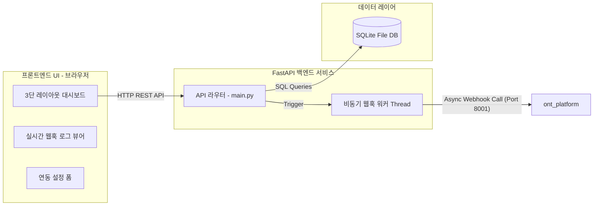

# System Architecture (s1_customer_board)

고객사 모의 게시판 시스템(`s1_customer_board`)의 컴포넌트 구성, 파일 레이아웃 및 동작 원리를 설명하는 아키텍처 명세서입니다.

---

## 🏗️ 컴포넌트 구성 요소

본 시스템은 가벼운 임베디드 데이터베이스(SQLite)와 FastAPI 백엔드, 그리고 단일 페이지 프리미엄 웹 프론트엔드가 하나로 결합된 통합 모의 웹 어플리케이션입니다.

### 1. FastAPI 백엔드 (Port 8090)
* **주요 기능**:
  * SQLite DB와의 연결 풀 관리 및 CRUD 트랜잭션 수행.
  * 프론트엔드 정적 파일 서빙 및 통합 설정 관리.
  * 폴링/웹훅에 최적화된 백그라운드 이벤트 트리거 스레드 가동.

### 2. SQLite 스토리지
* 프로젝트 루트 경로의 `s1_customer_board.db` 단일 파일에 모든 문의글 및 댓글 데이터를 저장합니다.
* 외래키(`post_id` -> `posts.id`)의 종속 삭제(`ON DELETE CASCADE`) 제약 조건을 활성화하여 참조 무결성을 유지합니다.

### 3. 비동기 웹훅 엔진 (Async Webhook Worker)
* 게시글 등록(`POST /api/posts`) 성공 시 메인 스레드의 대기 시간(latency)을 최소화하기 위해 별도의 비동기 `threading.Thread`를 실행하여 `ont_platform v5` 서버로 이벤트를 쏩니다.
* 타겟 서버가 꺼져 있어 발생하는 통신 예외 상황(Connection Timeout, Bad Gateway 등)을 감지하고 에러 로그를 캡처하여 프론트엔드의 웹훅 대시보드에 적재합니다.

### 4. 3단 프리미엄 대시보드 웹 인터페이스
* 별도의 빌드 도구 없이 브라우저에서 직접 구동할 수 있도록 단일 파일 구조(`HTMLResponse`)로 최적화되었습니다.
* **좌측 단 (Sidebar)**: 문의글 메타데이터 목록과 신규 작성을 위한 모달 버튼 배치.
* **중앙 단 (Content Panel)**: 선택된 글의 본문 상세 보기 및 실시간 2초 간격 리프레시 폴링 기반의 AI 댓글 타임라인.
* **우측 단 (Dashboard Panel)**: 실시간 웹훅의 온/오프 상태 및 모드 제어 설정 카드, 수동 배치 시뮬레이션 트리거 버튼, 최신 20건의 아웃바운드 웹훅 전송 결과 모니터링 로그 보드 내장.
