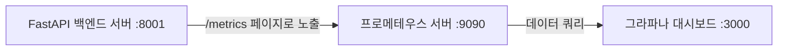

# 모니터링 환경 설정 및 구동 가이드

이 문서는 온톨로지 플랫폼(`ont_platform`)의 API 실행 통계 및 성능 메트릭을 수집하고 모니터링하기 위한 프로메테우스(Prometheus) 및 그라파나(Grafana)의 설정 및 구동 방법을 안내합니다.

## 모니터링 아키텍처 흐름



---

## 1. 프로메테우스(Prometheus) 설정 및 실행

프로메테우스는 주기적으로 백엔드 서버의 성능 데이터를 수집(Scrape)하여 저장하는 역할을 합니다.

### 설정 파일 위치
설정 파일은 `monitoring/prometheus.yml` 경로에 저장되어 있습니다.

```yaml
global:
  scrape_interval: 15s
  evaluation_interval: 15s

scrape_configs:
  - job_name: 'ontology-api'
    static_configs:
      - targets: ['localhost:8001']
    metrics_path: '/metrics'
```

### Docker를 사용한 프로메테우스 실행 방법
터미널에서 아래 명령어를 실행하여 프로메테우스 컨테이너를 구동합니다.

```bash
docker run -d \
  --name prometheus \
  -p 9090:9090 \
  -v E:/ontology_edu/X_ont_std/ont_platform/v3/monitoring/prometheus.yml:/etc/prometheus/prometheus.yml \
  prom/prometheus
```

실행이 완료되면 웹 브라우저를 통해 [http://localhost:9090](http://localhost:9090) 콘솔에 접속할 수 있습니다.

---

## 2. 그라파나(Grafana) 설정 및 실행

그라파나는 프로메테우스가 수집한 시계열 데이터를 보기 좋은 그래프와 차트 대시보드로 시각화해 줍니다.

### Docker를 사용한 그라파나 실행 방법
터미널에서 아래 명령어를 실행하여 그라파나 컨테이너를 구동합니다.

```bash
docker run -d \
  --name grafana \
  -p 3000:3000 \
  grafana/grafana
```

웹 브라우저를 통해 [http://localhost:3000](http://localhost:3000) 대시보드에 접속합니다. (초기 로그인 계정: `admin` / 비밀번호: `admin`)

### 프로메테우스 데이터 소스(Data Source) 연동 방법
1. 그라파나 로그인 후, 좌측 메뉴에서 **Connections** > **Data sources**를 클릭합니다.
2. **Add data source** 버튼을 누르고 **Prometheus**를 선택합니다.
3. Connection 항목의 URL 입력창에 다음 주소를 입력합니다:
   - 프로메테우스가 로컬 도커 컨테이너로 실행 중인 경우: `http://host.docker.internal:9090` 입력
4. 페이지 하단의 **Save & test** 버튼을 클릭하여 성공 메시지가 나타나는지 확인합니다.

---

## 3. 메트릭 노출 정상 여부 테스트

FastAPI 백엔드가 모니터링 데이터를 올바르게 출력하고 있는지 검증하려면 터미널에서 다음 주소로 테스트해 봅니다.

```bash
curl http://localhost:8001/metrics
```

정상적인 경우 다음과 같은 형태의 텍스트 기반 메트릭 정보가 대량으로 출력됩니다:
- `http_requests_total` (총 API 요청 횟수)
- `http_request_duration_seconds` (API 응답 지연 속도 분포)
- 가상 메모리 및 CPU 시스템 통계 등
