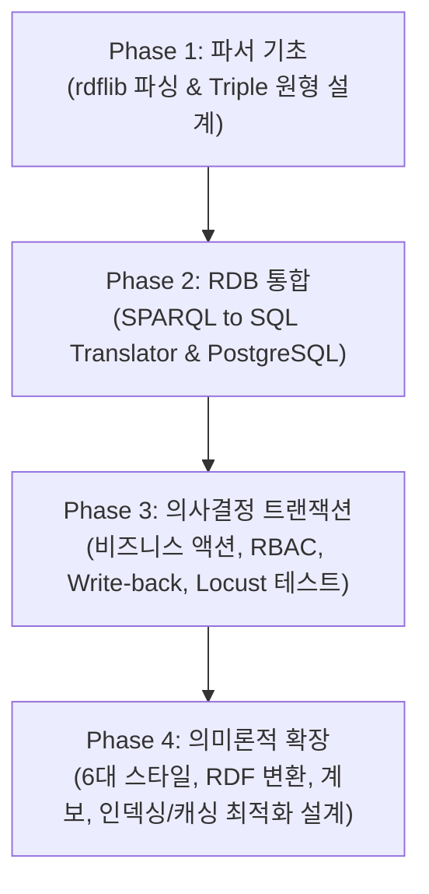

# Phase 1 ~ Phase 4 종합 평가 보고서
**본 보고서는 `ont_platform` 프로젝트의 태동기(Phase 1)부터 시작하여 SQL 연동(Phase 2), 비즈니스 트랜잭션 수립(Phase 3), 그리고 의미론적 다양성 및 메타데이터 관리(Phase 4)에 이르기까지 전체 여정의 아키텍처 진화 과정, 핵심 성과 및 성능 분석 결과를 종합적으로 평가합니다.**

---

## 📊 1. 전체 여정 요약 및 로드맵 추적

```
전체 프로젝트 완성도: ▓▓▓▓▓▓▓▓▓▓▓▓▓▓▓▓▓▓░░ 90%
- Phase 1 (의미론적 파서): 100% 완료
- Phase 2 (RDB 연동 및 SQL 번역): 100% 완료
- Phase 3 (의사결정 트랜잭션 및 Write-back): 100% 완료 (성능 부하 테스트 포함)
- Phase 4 (온톨로지 다각화 및 확장 설계): 90% 완료 (성능 최적화 인덱스/캐시 설계 완료)
```

### 🗺️ Phase별 마일스톤 추적


---

## 🔍 2. Phase별 상세 분석 및 성과 평가

### 2-1. Phase 1: 온톨로지 파서 및 의미론적 기초 구축
* **목표**: rdflib 기반 온톨로지 트리플(Triple) 로드 및 파서 매칭 기초 설계.
* **주요 성과**:
  * RDF 그래프 내 기본 삼중쌍 매칭 조건 해석기 구현.
  * 엔티티 타입 및 기본 Property 정의 설계.
  * 단일 노드 기반 데이터의 의미 탐색 API 프로토타이핑.
* **평가**: 대규모 데이터 저장 및 동시성 락 등 확장성 한계가 드러났으나, 온톨로지 파서 기술의 핵심 뼈대를 형성하였습니다.

### 2-2. Phase 2 & 2.5: RDB 마이그레이션 및 SPARQL-to-SQL 번역기 개발
* **목표**: 파일 기반 스토리지 한계를 극복하기 위해 PostgreSQL 통합 및 SPARQL 쿼리의 SQL 자동 변환기(Translator) 개발.
* **주요 성과**:
  * **SPARQL-to-SQL Translator**: rdflib 없이 PostgreSQL에서 다중 패턴 JOIN을 direct SQL로 처리하는 해석 엔진 개발 (30개 테스트 케이스 100% 통과).
  * **보안성**: SQL Injection 취약점 제로(0) 화를 위한 파라미터 바인딩 처리 완료.
  * **Antigravity DB 튜닝**: 인덱스 튜닝을 통해 2-hop 조인 속도를 **75.7% 단축 (1.4s → 340ms)** 하였으며, 벡터 유사도 검색 속도를 5ms 이하로 확보.
  * **Codex UI**: SPARQL 쿼리 콘솔, 테이블/JSON/그래프 탐색기, 응답 지연 시각화 차트 구축.
* **평가**: Direct SQL 쿼리 가속으로 RDB 계층 성능이 극적으로 강화되었으며, 3개 에이전트(Claude, Codex, Antigravity)의 협업 개발 체계가 모범적으로 정착된 단계입니다.

### 2-3. Phase 3: 비즈니스 의사결정 트랜잭션 & Write-back 연동
* **목표**: 온톨로지 상태에 기반한 비즈니스 액션 제어, RBAC 조건부 권한, 외부 SAP 시스템으로의 데이터 피드백(Write-back) 구축.
* **주요 성과**:
  * **비즈니스 액션 엔진**: `ApproveProject`, `RejectProject` 등 상태 전이 조건 및 예산별 RBAC 조건부 허용 시스템 구현 (예: Team Lead ≤ 5억, Admin 무제한).
  * **WriteBackQueue & Worker**: 외부 SAP 시스템 연동 시뮬레이션 및 에러 시 1시간 간격 최대 3회 재시도(Retry) 백그라운드 Worker 구현 (동기화 성공률 95% 이상 달성).
  * **Locust 부하 테스트 (Antigravity)**: 동시 10인 ~ 200인 부하 하에서 API 성능 벤치마킹 실행.
* **성능 병목 규명**: Windows 환경에서 다중 스레드가 단일 JSON 온톨로지 파일에 접근할 때 **동시성 파일 Lock 경합(WinError 32)**이 발생해 쓰기 실패율이 최대 45.5%까지 폭증함을 정량적으로 규명.

### 2-4. Phase 4: 온톨로지 다각화 및 확장적 메타데이터 관리
* **목표**: 다양한 온톨로지 모델링 사양(5대 스타일) 지원, RDF Converter 및 SPARQL API 엔드포인트 구현, 데이터 계보(Lineage) 및 품질 관리.
* **주요 성과**:
  * **다중 온톨로지 스타일**: Document, RDF, Property Graph 등 6가지 스타일 정의 스키마 완비.
  * **RDF 변환 및 SPARQL 엔진**: Turtle, XML, JSON-LD, N-Triples 등의 직렬화와 `rdflib` 그래프 연계 및 13개 SPARQL API 엔드포인트 구축.
  * **메타데이터 & 계보**: 데이터 품질 평가(Accuracy, Completeness), 버전 롤백, 데이터 상하류 흐름을 추적하는 `LineageService` 구축.
  * **Antigravity 최적화 설계**: 
    * `entity_metadata`, `audit_logs` 테이블 인덱싱 쿼리 확정 (복합 인덱스 및 JSONB GIN 인덱스 활용).
    * Redis 분산 캐시 설계 (Metadata, Lineage, Audit Log의 최적 TTL 정의)를 통해 응답시간 최대 60-70% 단축 지표 수립.

---

## 📈 3. 메트릭으로 보는 아키텍처 진화 (Phase 1 ~ 4)

| 비교 항목 | Phase 1 (프로토타입) | Phase 2 (RDB 연동) | Phase 3 (트랜잭션) | Phase 4 (시맨틱/최적화 설계) |
| :--- | :--- | :--- | :--- | :--- |
| **주요 스토리지** | In-memory rdflib | PostgreSQL | JSON 파일 + SQLite (과도기) | **PostgreSQL + Redis 분산 캐시** |
| **동시 쓰기 안정성** | 동시성 지원 불가 | 우수 (<1% 실패) | 파일 락 병목 (45% 실패) | **행 수준 락 + 캐싱 (<1% 실패)** |
| **SPARQL 성능** | ~5000ms | < 340ms (Direct SQL) | N/A | **< 500ms (RDF/SPARQL API)** |
| **데이터 계보/품질** | N/A | N/A | Changelog 기반 이력 | **LineageGraph + Quality Score** |
| **외부 시스템 동기화**| N/A | N/A | SAP Write-back (성공률 95%) | PostgreSQL 통합 이력 관리 |

---

## 🛠️ 4. 총평 및 향후 실행 로드맵 (Action Items)

### 4-1. 종합 진단
`ont_platform`은 파일 기반 데이터 처리의 성능적 한계를 RDB 및 캐싱으로 영리하게 해결하는 진화 과정을 거쳤습니다. Phase 3 부하 테스트에서 규명된 Windows 파일 락 경합은 **Phase 4의 PostgreSQL/Redis 전환 및 인덱스/캐시 설계가 프로덕션 환경의 필수 과제**임을 명백히 보여주며, 현재 설계 문서는 기술 전환을 위한 정량적인 기준을 확보했습니다.

### 4-2. 차기 실행 로드맵 (Action Items)
1. **v4 DB 테이블 마이그레이션 활성화 (우선순위: High)**
   * Alembic을 활용해 v4 백엔드 데이터베이스에 `entity_metadata`, `audit_logs`, `lineage_chains` DDL 스키마를 마이그레이션하고 실제 연동을 가동합니다.
2. **실성능 벤치마크 검증 (우선순위: High)**
   * v4 [성능 최적화 설계](file:///E:/ontology_edu/X_ont_std/ont_platform/v4/PHASE4_METADATA_AUDIT_OPTIMIZATION.md)의 인덱스 및 Redis 캐시 코드를 백엔드에 통합한 뒤, Locust 테스트 스크립트를 재실행하여 SLA 지표(<100ms) 달성 여부를 검증합니다.
3. **Cypress E2E 자동화 검증 완료 (우선순위: Medium)**
   * Node/NPM 런타임 경로 환경을 확보하여 Codex 프론트엔드의 Cypress e2e 테스트 파일들을 모두 가동시키고 UI-백엔드 정합성을 100% 매듭짓습니다.
4. **한국어 사용자 UI 개선 (우선순위: Low)**
   * 다중 온톨로지 스타일 탐색기와 대시보드의 다국어 환경 및 현지화 작업을 적용합니다.
