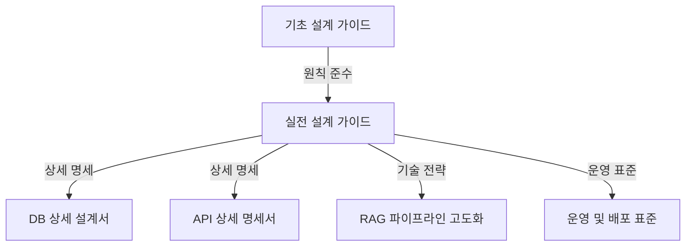

# AI 에이전트 표준 아키텍처 마스터 오버뷰 (Master Overview)

## 1. 아키텍처 전체 지도 (Architecture Map)
본 표준 아키텍처는 엔터프라이즈 환경에서의 확산과 유연한 운영을 목표로 **[원칙] - [전략] - [명세]**의 3단계 계층 구조로 설계되었습니다.

## 2. 문서별 역할 및 경로
각 문서는 목적에 따라 분리되어 있으며, 상호 참조 링크를 통해 연결됩니다.

| 계층 | 문서명 | 주요 내용 | 위치 |
| :--- | :--- | :--- | :--- |
| **원칙 (Core)** | 기초 설계 가이드 | 5대 핵심 관리 원칙, 메타데이터 표준 | `root/AI Agent 표준 아키텍처 설계-기초.md` |
| **전략 (Strategy)** | 실전 설계 가이드 | DB/API 아키텍처 요약, RAG 고도화 개요 | `std-work/AI Agent 표준 아키텍처 설계-실전.md` |
| **명세 (Spec)** | 01. DB 상세 설계 | 테이블 컬럼 명세, 인덱스 전략 | `std-work/details/01_DB_Schema_Detail.md` |
| **명세 (Spec)** | 02. API 상세 명세 | JSON 스키마, Pydantic 모델, 에러 코드 | `std-work/details/02_API_Interface_Spec.md` |
| **전략 (Spec)** | 03. RAG 파이프라인 | 하이브리드 검색, 리랭킹 알고리즘 | `std-work/details/03_RAG_Pipeline_Advanced.md` |
| **운영 (Spec)** | 04. 운영 표준 | 테넌트 격리, 로깅, 보안 규격 | `std-work/details/04_Deployment_Operation_Standard.md` |

## 3. 핵심 업무 흐름 (Core Workflow)
1.  **Ingestion**: 문서 업로드 → 청킹 → 임베딩 → TB_DOC_MASTER/CHUNK 기록
2.  **Retrieval**: 사용자 질문 → 하이브리드 검색(Vector + BM25) → 리랭킹 → 컨텍스트 추출
3.  **Generation**: 컨텍스트 + 프롬프트 → LLM 답변 생성 → 근거(Citation) 포함 응답

## 4. 향후 로드맵
*   **Phase 1**: 설계 표준 수립 (현재 진행 중)
*   **Phase 2**: 표준 아키텍처 기반의 참조 구현(Reference Implementation) 소스 공개
*   **Phase 3**: 도메인별(법률, 인사, 매뉴얼 등) 특화 프롬프트셋 및 인텐트 관리 표준 추가
